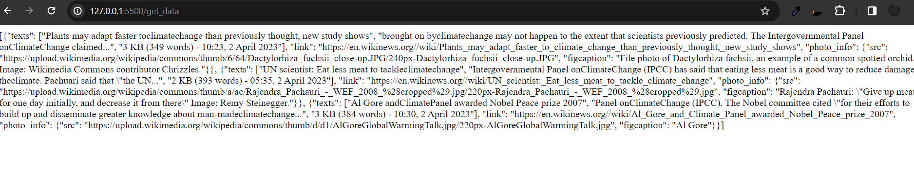
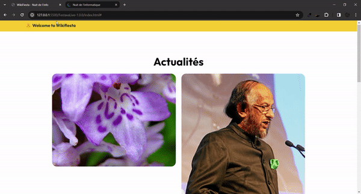

# WikiFiesta12

these script are for scraping data that talk about climate from the website en.wikinews.org
the data is then cleaned and senf in json format via restapi 
in our app we plan to use this in the news section 

the web design could be improved by making it dynamic and flexible with the diffrent images sizes
 

this script can be automated to fetch new news every "n" period. or event transormfed to draw data in real time.